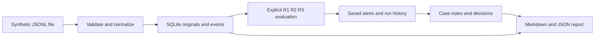

# SentinelLab local security investigation prototype

An AI-assisted learning project in Python, SQLite and browser fundamentals, developed through staged implementation and review. It turns uploaded login events into explained rule findings, retained evidence and documented investigations. It is designed for synthetic local demonstrations and a cybersecurity portfolio.

## Problem and intended user

An alert alone is insufficient for an investigation. A beginner needs to see which events caused the alert, understand the time window, retain the original records, record a reasoned decision and share a faithful report. SentinelLab provides that workflow while keeping a suspicious pattern separate from a confirmed compromise.

The intended user is a learner acting as a local analyst. There is one configured local account. This is not an enterprise SOC platform, public hosted service, live collector, malware detector or automated incident-response system.

## Implemented design

The parser enforces the documented login schema and input bounds, normalizes offset-aware timestamps to UTC and retains accepted original record text. Event identity combines source and event_id. Repeated identical imports add no new events; conflicting content does not replace the first original.

The rules evaluate stored event time in a sorted snapshot. R1 checks at least five failures for the same account/IP in 300 seconds. R2 checks ten distinct usernames per IP in 600 seconds. R3 checks a success after at least five earlier failures in 300 seconds, excluding equal-time failures. Versioned rule parameters, evidence references and stable identities accompany findings. Repeated saves add run history while deduplicating unchanged alerts.

SQLite transactions preserve related writes together. Investigations maintain a case state and append actions; revision checks prevent silently overwriting a decision based on stale state. Notes and decisions do not rewrite original evidence. JSON/Markdown reports read one database snapshot and include all saved case history and linked originals within documented bounds. Oversized reports fail instead of silently truncating.

Browser access uses an account with salted scrypt hashing, expiring in-memory sessions and protected write requests. The server is loopback-only HTTP. This does not encrypt the database or protect against someone with local filesystem access. Historical and CLI author labels may be self-declared. The implementation does not claim tamper-proof records or forensic chain of custody.

## Demonstrated outcome

The Day 17 synthetic demo imported sixteen events twice. The database retained sixteen unique events and two import records. Two saved detections produced three alerts and two runs. The R3 finding links five preceding failures and one success. A case created through the browser contains a factual note and an In progress / Suspicious decision at revision three. Both report formats agree on case, actions and evidence; export timestamps differ because they were produced separately.

See the [actual screenshots](README.md), [demo script](DEMO_SCRIPT.md) and [synthetic report](sample-report.md). The screenshots are real viewport captures, not fabricated UI. They do not substitute for a full browser or accessibility audit.

## Evaluation and verification

Day 15 introduced twelve labeled synthetic scenarios separate from earlier implementation fixtures. Intent labels were authored before the run, with knowledge of the rules. The scoring unit was a scenario; any alert counted as a positive. Results were TP 3, FP 3, TN 3 and FN 3. Precision, recall, specificity and accuracy were each 50 percent on this deliberately balanced set. All twelve expected rule sets agreed. Those facts measure different things: correct rule implementation can still produce false alarms and miss malicious stories.

Examples include a legitimate retrying client causing a false positive, slow attempts below the window threshold, distributed attempts across IPs and a stolen-password success without preceding failures. This is neither independent blinded evaluation nor an estimate of real-world detection rates. The corpus is now a regression benchmark, not unseen data for future tuning.

The Day 18 suite passed 194 tests in both the existing workspace and a fresh venv on Windows/MSYS2 Python 3.12.7. The exact GitHub ZIP downloaded with TLS verification enabled through bundled Python, and all 152 extracted blobs matched. The owner reported manual account creation; keyboard visibility was not independently observed. Earlier runtime certificate settings are not claimed repaired. Day 19 reran the seven-check authenticated HTTP rehearsal successfully with unchanged application source. See the [acceptance review](../FINAL_ACCEPTANCE.md), historical [setup record](../SETUP_REHEARSAL.md) and [candidate notes](../releases/v0.1.0-rc.1.md).

## Decisions and tradeoffs

The standard-library stack keeps dependencies small and makes the learning path easier to inspect, but is not a production hosting recommendation. SQLite simplifies a local demonstration; no multi-tenant scaling claim is made. Explicit import and detection make state changes understandable, while leaving live collection outside scope. Fixed thresholds are easy to explain, but their blind spots must remain visible. Original records and saved alert snapshots support review, but do not create cryptographic authenticity.

The interface was reorganized into Overview, Events, Detection and Investigations after usability feedback. Navigation retains drafts in browser memory; explicit saves persist data. Reload can still lose drafts. This is a tested design change, not a measured productivity improvement.

## Ownership and next work

This was developed with substantial AI assistance for code, tests, documentation and debugging. The learner's responsibility is to run the workflows, understand the design, challenge assumptions and explain decisions accurately. Do not claim independent authorship of every implementation detail or professional incident-response experience from this synthetic exercise.

Day 18 acceptance checks passed with qualifications. Day 19 prepares the first versioned release candidate and a simple presentation guide. Owner presentation practice, Word visual pagination and a final stable release decision remain pending. Public hosting, live collection, multiple roles and stronger evidence integrity would require additional design and verification. No cost savings, prevented incidents, enterprise scale or performance metrics have been measured.
