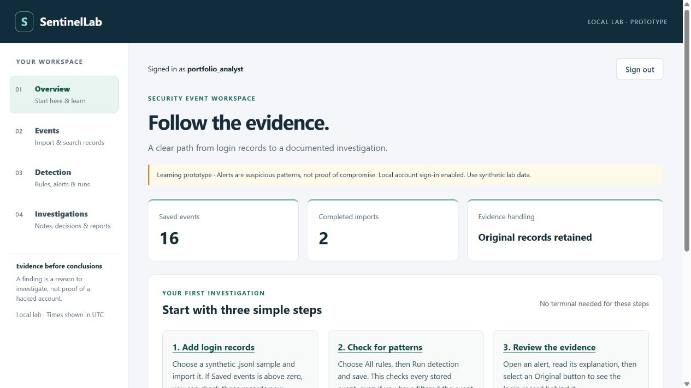
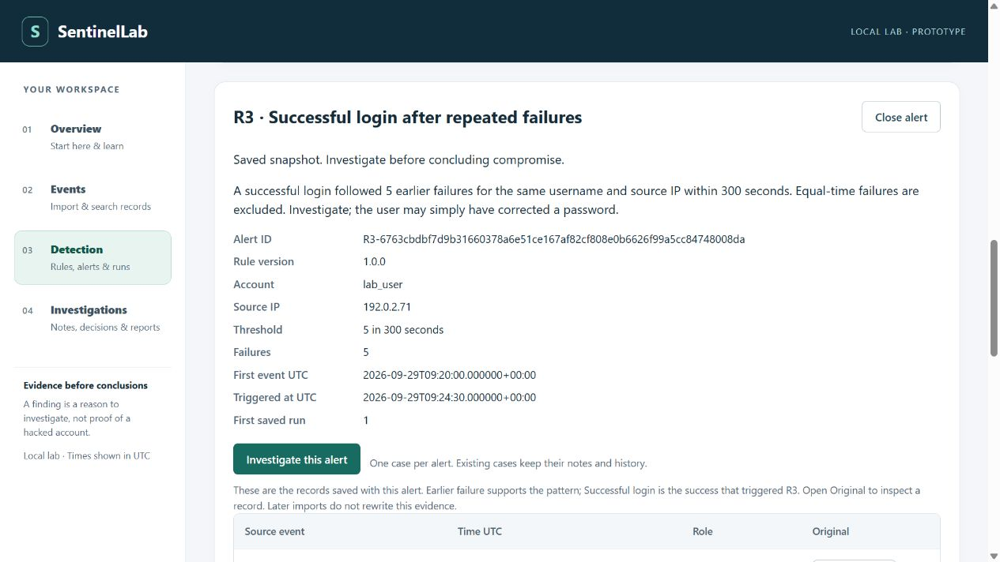
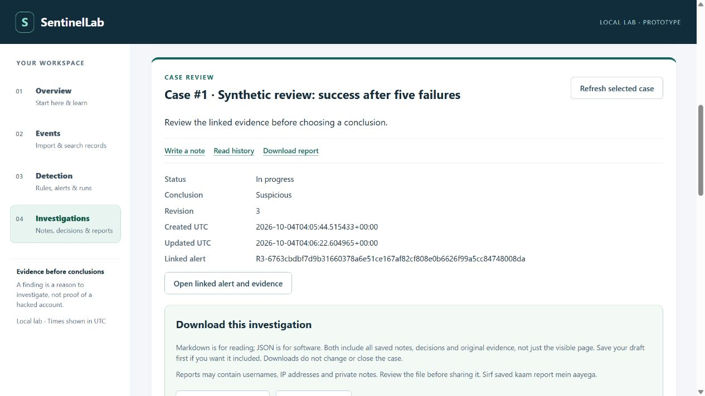

# SentinelLab portfolio material

Final local portfolio milestone v0.1.0, 4 October 2026. Start with the [project summary](PROJECT_SUMMARY.md) and [handover](../HANDOVER.md). This folder presents a guided AI-assisted learning prototype, not a production deployment or independent certification. Presentation practice is optional.

- [Five minute demonstration](DEMO_SCRIPT.md): ordered steps, speaking notes, expected results and recovery.
- [Project case study](CASE_STUDY.md): problem, design, evidence, tradeoffs, evaluation and limitations.
- [CV and interview notes](CV_AND_INTERVIEW.md): accurate project wording, explanation prompts and ownership guidance.
- [Release readiness](../RELEASE_READINESS.md): all fifteen acceptance criteria mapped to evidence and retained qualifications.
- [Synthetic example report](sample-report.md) and [JSON version](sample-report.json): real exports from the browser-created demonstration case. Their export timestamps differ because they were generated separately; saved case, actions and evidence agree.

All screenshots and example report data in this folder are synthetic. They show the actual application, not generated mockups. Screenshots are viewport excerpts, not a complete export of every record or a full accessibility audit. No credential file, cookie or private investigation was included.

## Overview

The demo has 16 saved events after two imports of the same sample. Completed imports counts attempts; saved events counts unique records.

## Explained finding

R3 links five earlier failures and one successful login for lab_user at 192.0.2.71. The interface explains the threshold and warns against concluding compromise. Additional evidence rows continue below this viewport.

## Reasoned investigation

Case 1 is In progress / Suspicious at revision 3 after creation, a note and a decision. This is not a confirmed incident. The report exports retain the full saved history and original evidence.

